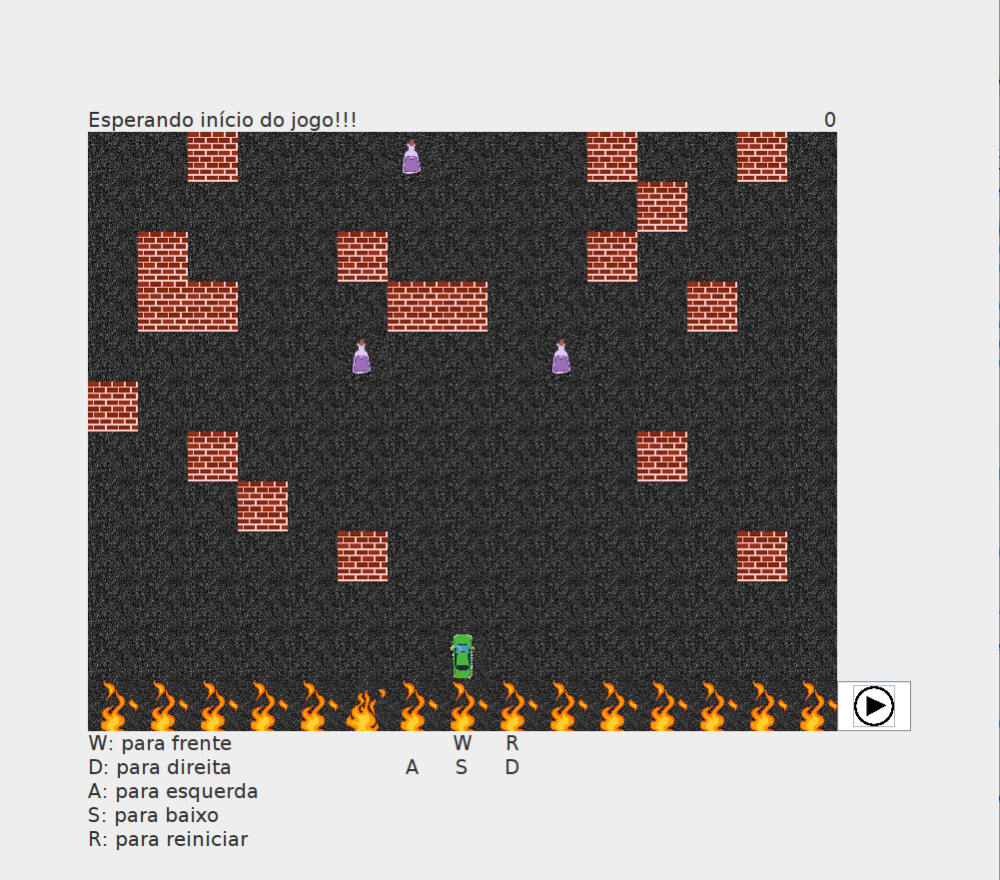
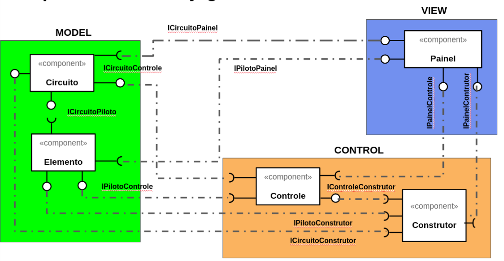
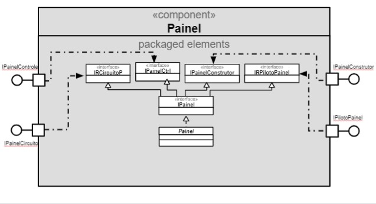
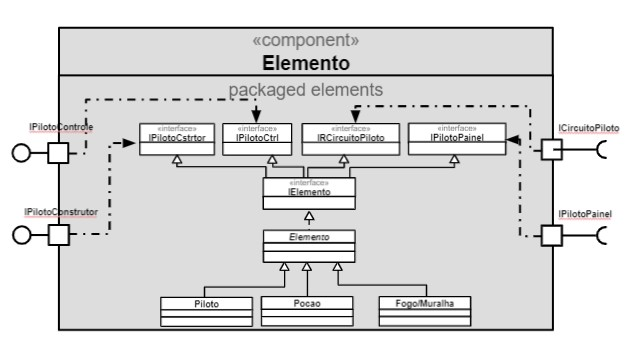
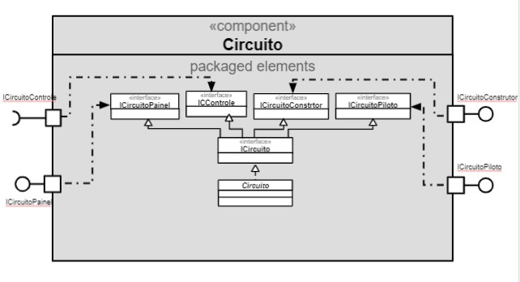
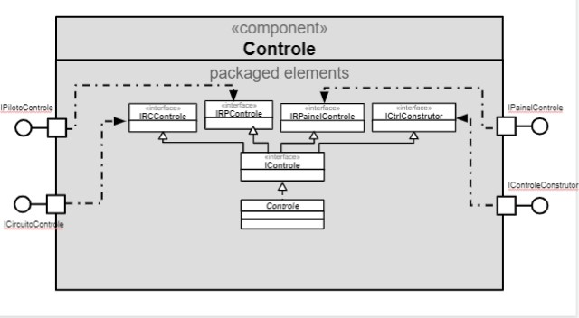
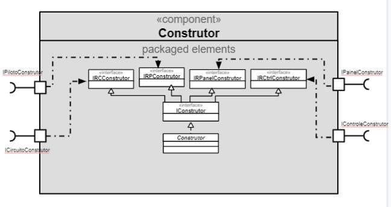
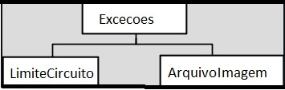

# Projeto Corridinha da Massa

# Descrição Resumida do Projeto/Jogo
Corrida da massa é um jogo de corrida em que o jogador personifica um piloto que
participa de uma competição de corrida com obstáculos. Mas essa não é uma 
corrida normal, pois a vida do piloto depende dele completar o circuito 
que é imprevisível e cheio de perigos. O circuito há obstáculos, sendo alguns 
apenas muros intransponíveis enquanto outros labaredas de fogo mortais.
Há também, no ciruito, porções mágicas que dotam o carro de habilidades
especiais e que podem ser essenciais para a sobrevivência do piloto.

# Equipe Peixonauta
Pablo Areia Delgado. R.: 223037

Randerson Araújo de Lemos. RA.: 103897

# Vídeos do Projeto
## Vídeo da Prévia
[vídeo](https://www.youtube.com/watch?v=wtWPpYuzdb8)

# Slides dos Projeto
## Slides da Prévia
[apresentação](./assets)

# Documentação
## Diagramas
### Diagrama Geral do Projeto

## Diagrama Geral dos Componentes

## Componente `Painel`

**Ficha Técnica**
item | detalhamento
----- | -----
Classe | [Classe Painel](src/src/mc322/lab07/view/painel/Painel.java)
Autores | `<Pablo e Randerson>`
Interfaces | IPainelConstrutor   IPainelControle   IRCircuitoPainel   IRPilotoPainel

~~~java
public interface IPainel extends 
  IPainelConstrutor
, IPainelControle
, IRCircuitoPainel
, IRPilotoPainel
{
}
~~~
## Componente `Elemento`

**Ficha Técnica**
item | detalhamento
----- | -----
Classe | [Classe Elemento](src/src/mc322/lab07/model/elemento/Elemento.java)
Autores | `<Pablo e Randerson>`
Interfaces |  IPilotoControle   IPilotoConstrutor   IPilotoPainel   IRCircuitoPiloto

~~~java
public interface IPiloto extends
  IPilotoControle
, IPilotoConstrutor
, IPilotoPainel
, IRCircuitoPiloto
{
}
~~~
## Componente `Circuito`

**Ficha Técnica**
item | detalhamento
----- | -----
Classe | [Classe Circuito](src/src/mc322/lab07/model/circuito/Circuito.java)
Autores | `<Pablo e Randerson>`
Interfaces | ICircuitoContrutor   ICircuitoControle   ICircuitoPainel    ICircuitoPiloto

~~~java
public interface ICircuito extends 
  ICircuitoConstrutor
, ICircuitoControle
, ICircuitoPainel
, ICircuitoPiloto{
}
~~~
## Componente `Controle`

**Ficha Técnica**
item | detalhamento
----- | -----
Classe | [Classe Controle](src/src/mc322/lab07/control/controle/Controle.java)
Autores | `<Pablo e Randerson>`
Interfaces | IControleConstrutor   IRCircuitoControle   IRPilotoControle   IRPainelControle

~~~java
public interface IControle extends 
  IControleConstrutor 
, IRCircuitoControle
, IRPilotoControle
, IRPainelControle 
{
	public void comecarJogo();
}
~~~
## Componente `Construtor`

**Ficha Técnica**
item | detalhamento
----- | -----
Classe | [Classe Construtor](src/src/mc322/lab07/control/construtor/Construtor.java)
Autores | `<Pablo e Randerson>`
Interfaces | IRCircuitoConstrutor   IRControleConstrutor   IRPilotoConstrutor   IRPainelConstrutor

~~~java
public interface IConstrutor extends 
  IRCircuitoConstrutor
, IRControleConstrutor
, IRPilotoConstrutor
, IRPainelConstrutor
{
	public void construir(int maxLin, int maxCol);
}
~~~
## Detalhamento das Interfaces

### Interface `IControleConstrutor`
~~~java
public interface IControleConstrutor {
	Elemento geradorAleatorioDeElementosSemPiloto(int lin, int col);
}
~~~
Método | Objetivo
-------| --------
`geradorAleatorioDeElementosSemPiloto` | Gera um Elemento seguindo certas probabilidades   Possibilidades: Asfalto, Muro, Fogo ou Poção

### Interface `ICircuitoContrutor`
Construtor poder criar a matriz do Objeto Circuito (matriz back-end)
~~~java
public interface ICircuitoConstrutor 
{
	void setMatriz(int maxLin, int maxCol, Elemento matriz[][]);
}
~~~
Método | Objetivo
-------| --------
`setMatriz` | Atualiza a matriz Circuito

### Interface `ICircuitoControle`
Controle ter acesso a informações sobre a matriz e poder atualizá-la
~~~java
public interface ICircuitoControle {
	public int getMaxLin();
	public int getMaxCol();
	void setElemento(Elemento elemento);
	public Elemento getElemento(int lin, int col);
	
}
~~~
Método | Objetivo
-------| --------
`getMaxLin` | Acessa o numero de linhas da matriz Circuito
`getMaxCol` | Acessa o numero de colunas da matriz Circuito
`setElemento` | Atualiza uma posição da matriz Circuito (ou seja, um Elemento)
`getElemento` | Acessa uma posição da matriz Circuito (ou seja, um Elemento)

### Interface `ICircuitoPainel`
Interligar as matrizes back-end e front-end
~~~java
public interface ICircuitoPainel 
{
	public int getMaxLin();
	public int getMaxCol();
	public Elemento getElemento(int lin, int col);
}
~~~
Método | Objetivo
-------| --------
`getMaxLin` | Acessa o numero de linhas da matriz Circuito
`getMaxCol` | Acessa o numero de colunas da matriz Circuito
`getElemento` | Acessa uma posição da matriz Circuito (ou seja, um Elemento)

### Interface `ICircuitoPiloto`
Piloto e Circuito são independentes no código, o objeto Piloto sabe onde ele está, mas precisa de informações do Circuito para conhecer os arredores
~~~java
public interface ICircuitoPiloto 
{
	public int getMaxLin();
	public int getMaxCol();
	public Elemento getElemento(int lin, int col);
}
~~~
Método | Objetivo
-------| --------
`getMaxLin` | Acessa o numero de linhas da matriz Circuito
`getMaxCol` | Acessa o numero de colunas da matriz Circuito
`getElemento` | Acessa uma posição da matriz Circuito (ou seja, um Elemento)

### Interface `IPilotoConstrutor`
Construtor poder criar o Objeto Piloto
~~~java
public interface IPilotoConstrutor {
	public void setPosicao(int lin, int col);
}
~~~
Método | Objetivo
-------| --------
`setPosicao` | Atualiza a posição do piloto (essa informação é guardada no Piloto)

### Interface `IPilotoControle`
Controle poder ter as informações do piloto e poder atualizá-lo
~~~java
public interface IPilotoControle {
	public void moverParaCima();
	public void moverParaBaixo();
	public void moverParaEsquerda();
	public void moverParaDireita();
	public int getLin();
	public int getCol();
	public void setImagemIcon1();
	public void setImagemIcon2();
	public void setImagemIcon3();
	public void setPosicao(int lin, int col);	
	public void setPoderzin(int valor);
	public int getPoderzin();
}
~~~
Método | Objetivo
-------| --------
`moverParaCima` | Move o piloto para cima se possível
`moverParaBaixo` | Move o piloto para baixo se possível
`moverParaEsquerda` | Move o piloto para esquerda se possível
`moverParaDireita` | Move o piloto para direita se possível
`getLin` | Acessa a linha que o Elemento está
`getCol` | Acessa a coluna que o Elemento está
`setImagemIcon1,2,3` | Acessam imagens específicas (1,2 ou 3) (arquivos de imagem que serão incrementados na interface gráfica)
`setPosicao` | Atualiza a posição do piloto (essa informação é guardada no Piloto)
`setPoderzin` | Dispara o tempo de duração da poção -> tempo = x;
`getPoderzin` | Acessa o tempo atual restante de duração da poção

### Interface `IPilotoPainel`
O piloto só está inserido na matriz front-end, Painel pega suas informações e atualiza a matriz
~~~java
public interface IPilotoPainel 
{
	public int getLin();
	public int getCol();
	public ImageIcon getImageIcon();
}
~~~
Método | Objetivo
-------| --------
`getLin` | Acessa a linha que o Elemento está
`getCol` | Acessa a coluna que o Elemento está
`getImageIcon` | Acessa a imagem de um Elemento (arquivo de imagem que será incrementado na interface gráfica)

### Interface `IPainelConstrutor`
Construtor cria o Objeto Painel (matriz front-end) sobre as condições iniciais do objeto Circuito
~~~java
public interface IPainelConstrutor 
{
	public void setMatriz(int maxLin, int maxCol, JLabel matriz[][]);
}
~~~
Método | Objetivo
-------| --------
`setMatriz` | Atualiza a matriz Painel

### Interface `IPainelControle`
Controle ser capaz de atualizar a interface gráfica a cada iteração
~~~java
public interface IPainelControle 
{
	public void atualizarPainel();
	public void mostrarPainel();
	public void atualizarImagemCircuitoPainel();
	public void atualizarImagemPilotoPainel();
	public void addPlayActionListener(ActionListener I);
	public void addPlayKeyListener(KeyListener I);
	public void atualizarScore(int valor);
	public void atualizarStatus(String mensagem);
}
~~~
Método | Objetivo
-------| --------
`atualizarPainel` | atualiza o estado do Painel (o que o player vai ver)
`mostrarPainel` | manda mostrar o Painel em seu estado atualizado
`atualizarImagemCircuitoPainel` | atualiza o circuito mostrado do Painel (matirz front-end) a partir do objeto Circuito (matriz back-end)
`atualizarImagemPilotoPainel` | atualiza a posição do Piloto no Painel
`addPlayActionListener` | cria um observador
`addPlayKeyListener` | cria um observador que dispara um evento quando uma tecla é apertada
`atualizarScore` | Atualiza a pontuação do player mostrado no painel
`atualizarStatus` | Atualiza o status do jogo mostrado no painel

## Plano de Exceções

## Descrição das classes de exceção

Classe | Descrição
----- | -----
Excecoes | Engloba todas as exceções de divisões não aceitas.
LimiteCircuito | Indica que há acesso a posoções inválidas da matriz
ArquivoImagem | Indica que está recebendo um arquivo de imagem inválido
