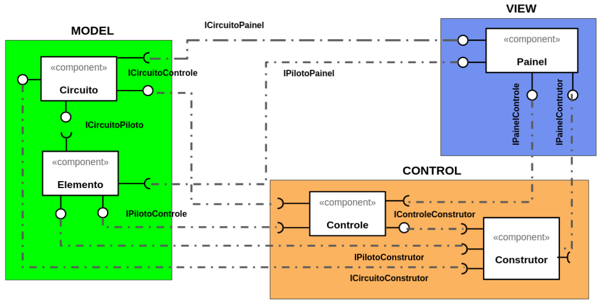

# Projeto Corridinha da Massa

# Descrição Resumida do Projeto/Jogo
Corrida da massa é um jogo de corrida em que o jogador personifica um piloto que
participa de uma competição de corrida com obstáculos. Mas essa não é uma 
corrida normal, pois a vida do piloto depende dele completar o circuito 
que é imprevisível e cheio de perigos. O circuito há obstáculos, sendo alguns 
apenas muros intransponíveis enquanto outros labaredas de fogo mortais.
Há também, no ciruito, porções mágicas que dotam o carro de habilidades
especiais e que podem ser essenciais para a sobrevivência do piloto.

# Equipe Peixonauta
Pablo Areia Delgado. R.: 223037

Randerson Araújo de Lemos. RA.: 103897

# Vídeos do Projeto
## Vídeo da Prévia
[vídeo](https://www.youtube.com/watch?v=wtWPpYuzdb8)

# Slides dos Projeto
## Slides da Prévia
[apresentação](./assets)

# Documentação
## Diagramas
### Diagrama Geral do Projeto

## Diagrama Geral dos Componentes

## Componente `Painel`
## Componente `Elemento`
## Componente `Circuito`
## Componente `Controle`
## Componente `Construtor`

## Detalhamento das Interfaces
### Interface <nome da interface>

## Plano de Exceções
